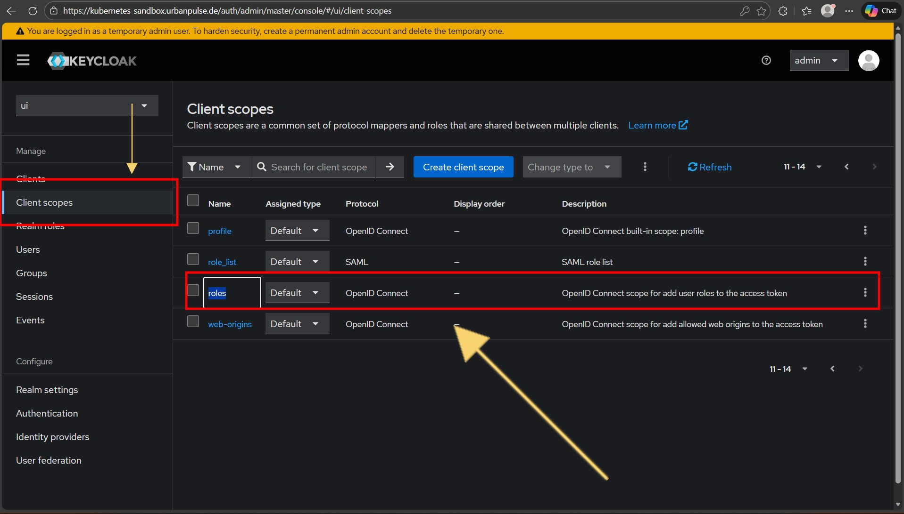
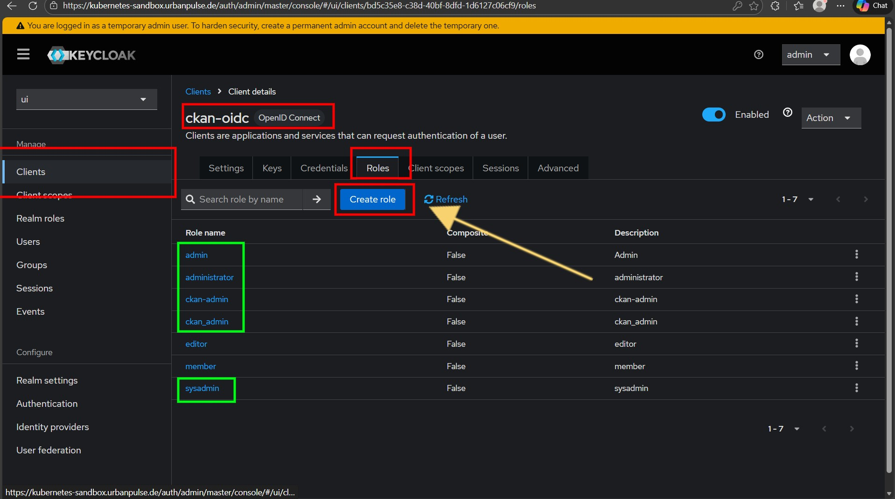
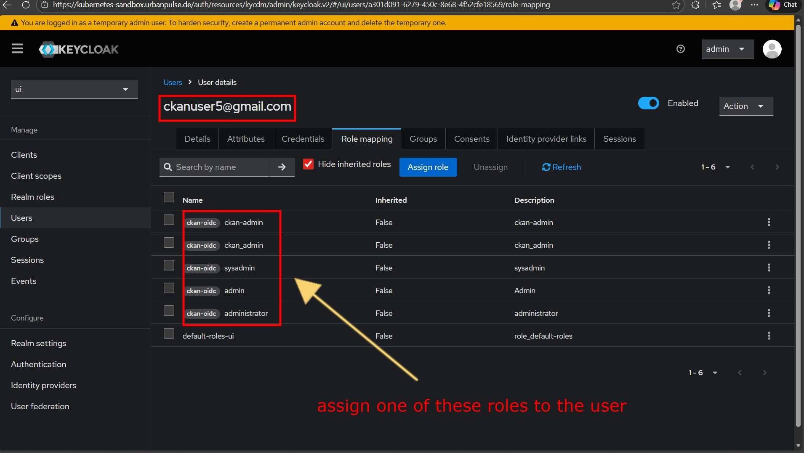

# ckanext-sso

## 🚨🚨 In this forked version of ckanext-sso-dathere, we will allow Keycloak users to manage CKAN administrators directly within Keycloak using #Role Mapping!!!! 🚨🚨


## 1. Introduction
**ckanext-sso** is an extension for CKAN, a powerful data management system that makes data accessible and usable. This extension provides Single Sign-On (SSO) capabilities, allowing users to log in to CKAN using various SSO providers.

## Tested on
- CKAN 2.9
- CKAN 2.10

## 2. Features

* SSO Integration: Seamlessly integrate with popular SSO providers.
* Easy Configuration: Simple setup to connect with your existing SSO system.
* Enhanced Security: Leverage SSO for a secure authentication experience.

## 3. Installation

To install the extension:

- activate your virtual environment ie `. /usr/lib/ckan/default/bin/activate`

- Install the requirements `pip install -r requirements.txt`

- Install the package `python setup.py install`

- Add `sso` settings in CKAN config file

## Configuration

``` ini

ckan.plugins = sso {OTHER PLUGINS}

## ckanext-sso
ckanext.sso.authorization_endpoint = [authorization_endpoint]
ckanext.sso.login_url = [login_url]
ckanext.sso.client_id = [client_id]
ckanext.sso.redirect_url = [https://myckansite.com/dashboard]
ckanext.sso.client_secret = [client_secret]
ckanext.sso.response_type = [code]
ckanext.sso.scope = [openid profile email]
ckanext.sso.access_token_url = [access_token_url]
ckanext.sso.user_info = [user_info_url]
ckanext.sso.disable_ckan_login = [True|False]
```

## 4. Usage

After installing the extension and configuring the settings, you can now log in to CKAN using your SSO credentials.

## Contributing

Contributions are welcome! Please read our [contributing guide](CONTRIBUTING.md) to learn more.

## 5. License

This project is licensed under the terms of the [MIT License](LICENSE).

## 6. Contact

If you have any questions, please feel free to reach out to us at [
datHere Support](mailto:<support@dathere.com>).

## 7. Setup Keycloak

As mentioned at the beginning. This plugin supoort just client-user role mapping. It was only tested on Keycloak version 26.0.0 and ckan 2.11.4 and worked very well


a- Create a normal OpenID Connect client.

b-Ensure that the client scope roles is included in the client scopes of your created CKAN client, as shown in the following picture. It must be set as a default client scope so that the roles are sent automatically in the token.

If the roles client scope is not present in your CKAN client scopes, add it. If it is not available as an option (although it should exist by default in Keycloak), you must first create it under Client Scopes, name it roles, and add the predefined mapper client roles. Then assign it to your CKAN client as a default client scope.


c- Define the roles. Go to Clients → <your-ckan-client> → Roles → Create Role Here, you can create one or all of the following five roles: (admin, administrator, ckan-admin, ckan_admin, sysadmin). All of these roles can grant admin privileges (only one is actually sufficient).


d- Now you are ready to make any user an admin. Go to: Users → <your-user> → Role Mapping → <your-client-admin-role>. Then log in again.





