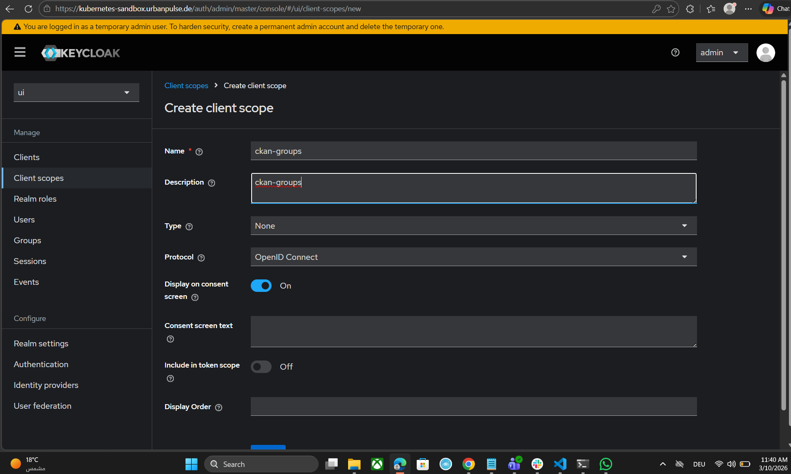
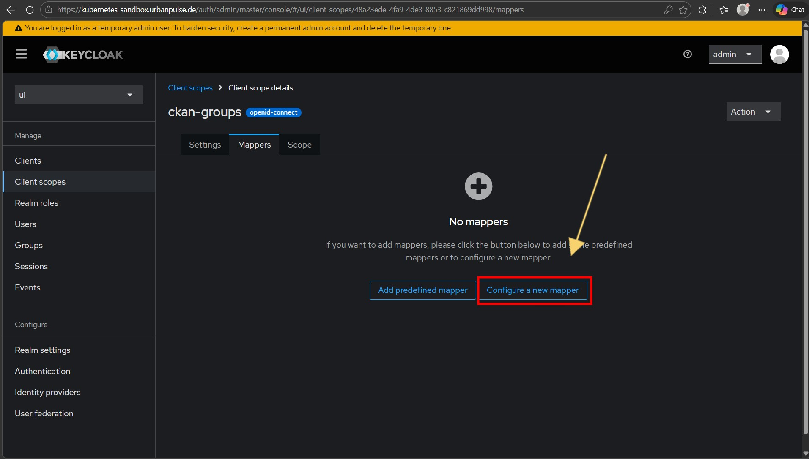
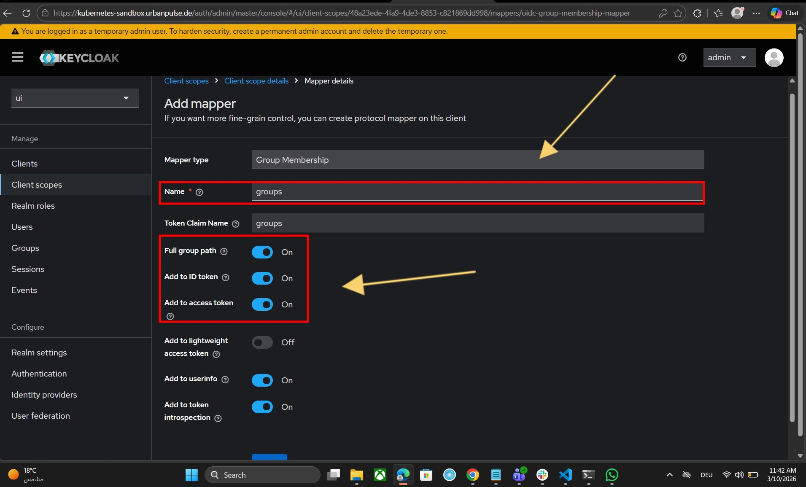
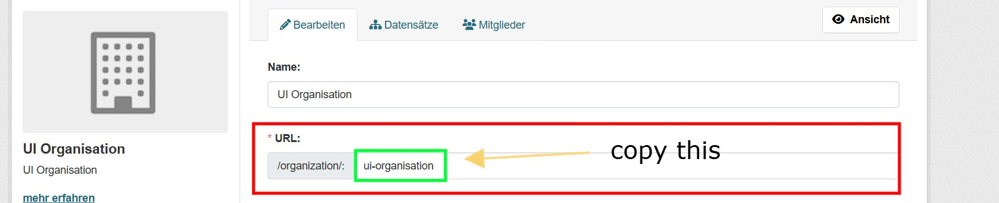
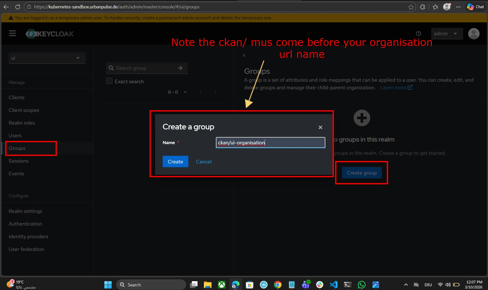
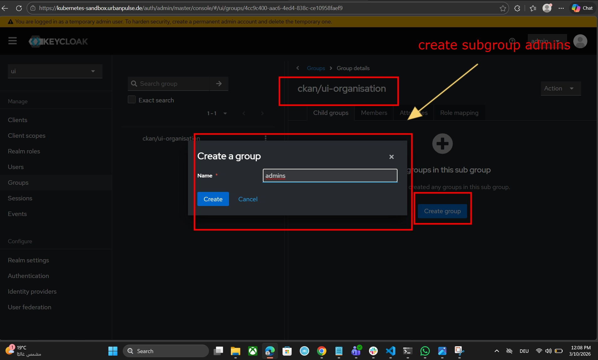
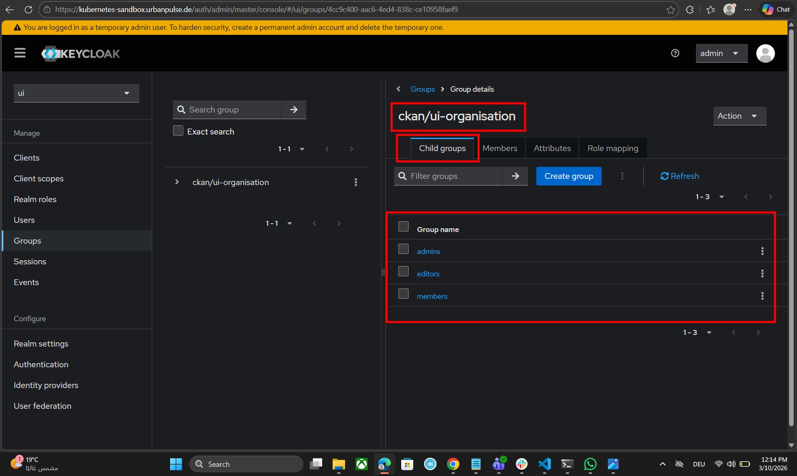

## Table of Contents

1. [Forking explained](#1-introduction)
2. [Introduction](#2-introduction)
3. [Features](#3-features)
4. [Installation](#4-installation)
5. [Configuration](#5-configuration)
6. [Usage](#6-usage)
7. [Contributing](#7-contributing)
8. [License](#8-license)
9. [Contact](#9-contact)
10. [How to Manage CKAN Global Admin Users in Keycloak](#10-how-to-manage-ckan-global-admin-users-in-keycloak)
11. [How to Manage Organisation Members and Their Roles (Admin, Editor, Member)](#11-how-to-manage-organisation-members-and-their-roles-admin-editor-and-member)


# ckanext-sso

### 1. Forking explained

🚨🚨 We forked ckanext-sso-dathere for two reasons. The first is to enable sysadmin management directly within Keycloak. The second reason is to manage user roles (admins, editors, and members) within the organisation.

To manage sysadmins in CKAN, we use Role Mapping.

To manage roles inside the organisation (admin, member, editor), we use groups.

Scroll down to Manage Sysadmins in Keycloak and Manage CKAN User Organisation Roles in Keycloak.


### 2. Introduction
**ckanext-sso** is an extension for CKAN, a powerful data management system that makes data accessible and usable. This extension provides Single Sign-On (SSO) capabilities, allowing users to log in to CKAN using various SSO providers.

### Tested on
- CKAN 2.9
- CKAN 2.10

### 3. Features

* SSO Integration: Seamlessly integrate with popular SSO providers.
* Easy Configuration: Simple setup to connect with your existing SSO system.
* Enhanced Security: Leverage SSO for a secure authentication experience.

### 4. Installation

To install the extension:

- activate your virtual environment ie `. /usr/lib/ckan/default/bin/activate`

- Install the requirements `pip install -r requirements.txt`

- Install the package `python setup.py install`

- Add `sso` settings in CKAN config file

### 5. Configuration

``` ini

ckan.plugins = sso {OTHER PLUGINS}

## ckanext-sso
ckanext.sso.authorization_endpoint = [authorization_endpoint]
ckanext.sso.login_url = [login_url]
ckanext.sso.client_id = [client_id]
ckanext.sso.redirect_url = [https://myckansite.com/dashboard]
ckanext.sso.client_secret = [client_secret]
ckanext.sso.response_type = [code]
ckanext.sso.scope = [openid profile email]
ckanext.sso.access_token_url = [access_token_url]
ckanext.sso.user_info = [user_info_url]
ckanext.sso.disable_ckan_login = [True|False]
```

### 6. Usage

After installing the extension and configuring the settings, you can now log in to CKAN using your SSO credentials.

### 7. Contributing

Contributions are welcome! Please read our [contributing guide](CONTRIBUTING.md) to learn more.

### 8. License

This project is licensed under the terms of the [MIT License](LICENSE).

### 9. Contact

If you have any questions, please feel free to reach out to us at [
datHere Support](mailto:<support@dathere.com>).

### 10. How to Manage CKAN Global Admin Users in Keycloak

a- Create a normal OpenID Connect client.

b-Ensure that the client scope roles is included in the client scopes of your created CKAN client, as shown in the following picture. It must be set as a default client scope so that the roles are sent automatically in the token.

If the roles client scope is not present in your CKAN client scopes, add it. If it is not available as an option (although it should exist by default in Keycloak), you must first create it under Client Scopes, name it roles, and add the predefined mapper client roles. Then assign it to your CKAN client as a default client scope.


c- Define the roles. Go to Clients → <your-ckan-client> → Roles → Create Role Here, you can create one or all of the following five roles: (admin, administrator, ckan-admin, ckan_admin, sysadmin). All of these roles can grant admin privileges (only one is actually sufficient).


d- Now you are ready to make any user an admin. Go to: Users → <your-user> → Role Mapping → <your-client-admin-role>. Then log in again.


### 11. How to manage organisation members and their roles (admin, editor and member)

As we know, in CKAN we can manage the members of the groups and their roles inside the group directly from within CKAN. However, we want to make Keycloak the single source of truth to manage organisation members and their roles.

a- The first thing we have to ensure is that the group list is sent with the token. Therefore, we need to create a client scope and assign it to the CKAN client.

So click on **Client Scopes** → **Create Client Scope** → name it **ckan-groups**.




Now we have to add a group mapper. Please click on **"Configure a new mapper"**.



Now choose **Group Membership** mapping, give it a name, and ensure that all the toggles **`Full group path`**, **`Add to ID token`**, and **`Add to access token`** are enabled.


b- Now you can create groups, but there is a strict convention that you have to follow so that this feature works. When creating groups in Keycloak, please follow this convention:

`/ckan/<organization-name>/admins`

The organisation name is not the title but the organisation URL, as shown in the following picture.



After that create a parent group in ckan with `ckan/<organization-name>` and the create 3 subgroups `admins, editors and members`  in plural exactly inside `ckan/<organization-name>` as shown in the following example:







